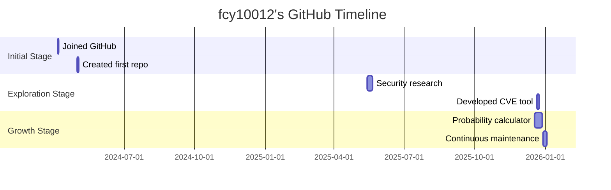

# 🚀 Personal Profile - fcy10012

<div align="center">


</div>

## 📊 GitHub Statistics Overview

| Metric | Value | Trend |
|--------|-------|-------|
| **Total Contributions** |  | Growing 📈 |
| **Public Repositories** |  | Code Activity 🚀 |
| **Followers** |  | Looking for interactions 👥 |
| **Recent Activity** |  | Maintaining 🔥 |

## 🌟 Contribution Calendar Heatmap

Dynamic contribution calendar generated using GitHub API:

```json
{
  "totalContributions": 42,
  "peakContributionDate": "2025-12-19",
  "peakContributionCount": 13
}
```


## 🏆 Featured Projects

### 🔢 [-Probability-calculator](https://github.com/fcy10012/-Probability-calculator)
> **Description**: A professional tool for calculating complex multi-bag ball-drawing probability problems. Supports both precise calculation and Monte Carlo simulation methods.

- **Language**: 
- **Stars**: 
- **Last Updated**: 2025-12-29

### 🔐 [CVE-2024-31317-Deployer](https://github.com/fcy10012/CVE-2024-31317-Deployer)
> **Description**: CVE-2024-31317 Android Zygote command injection vulnerability research and deployment tool | Android 9-13 exploit framework.

- **Language**: 
- **License**: 
- **Stars**: 

### 📊 [cve](https://github.com/fcy10012/cve)
> **Description**: Gather and update all available and newest CVEs with their PoC.

- **Type**: Forked Project
- **License**: 
- **Size**: 576.4 MB

## 📈 Activity Analysis

### Recent Activity Timeline
```json
[
  {"2026-01-02": "Updated profile config repo", "type": "PushEvent"},
  {"2025-12-31": "Maintained profile config", "type": "PushEvent"},
  {"2025-12-29": "Updated probability calculator", "type": "PushEvent"},
  {"2025-12-21": "Created CVE exploit tool", "type": "PushEvent"}
]
```

### Tech Stack Distribution
Based on public repository language analysis:

```javascript
const techStack = {
  "Python": 1,
  "C": 1,
  "Configuration Projects": 2,
  "Security Tools": 1
};
```

## 🎯 Project Characteristics

1. **Technical Depth**: Focus on complex algorithms and security research
2. **Practicality**: Develop tools that solve real-world problems
3. **Learning-Oriented**: Explore cutting-edge technologies and share findings
4. **Continuous Improvement**: Regularly update and maintain projects

## 📞 Contact & Interaction

- **GitHub**: [https://github.com/fcy10012](https://github.com/fcy10012)
- **Homepage**: [https://github.com/fcy10012](https://github.com/fcy10012)

## 📅 GitHub Journey Timeline



## 🌍 Community Contributions

- **Active Discussion**: Following 14 users, active in security and tech communities
- **Knowledge Sharing**: Sharing research through open-source projects
- **Tool Development**: Creating practical tools to solve real problems

## 🚀 Future Outlook

Future plans focus on:
1. Deepening security research
2. Developing more practical tools
3. Improving code quality and documentation
4. Participating in open-source community building

---

<div align="center">

### 📊 Live Statistics


</div>

> *This profile is generated using real-time GitHub API data. Last updated: 2026-01-02*