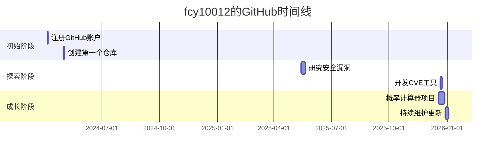

# 🚀 fcy10012 的个人简介

<div align="center">


</div>

## 📊 GitHub 统计概览

| 指标 | 数值 | 趋势 |
|------|------|------|
| **总贡献数** |  | 持续增长 📈 |
| **公共仓库** |  | 代码活跃度 🚀 |
| **关注者** |  | 期待更多互动 👥 |
| **最近活跃** |  | 持续维护中 🔥 |

## 🌟 贡献日历热力图

使用GitHub API动态生成的贡献日历：

```json
{
  "totalContributions": 42,
  "peakContributionDate": "2025-12-19",
  "peakContributionCount": 13
}
```


## 🏆 热门项目

### 🔢 [-Probability-calculator](https://github.com/fcy10012/-Probability-calculator)
> **描述**: 这是一个用于计算复杂多袋摸球问题概率的专业工具。支持精确计算和蒙特卡洛模拟两种方法

- **语言**: 
- **星标**: 
- **最后更新**: 2025-12-29

### 🔐 [CVE-2024-31317-Deployer](https://github.com/fcy10012/CVE-2024-31317-Deployer)
> **描述**: CVE-2024-31317 Android Zygote命令注入漏洞研究与部署工具 | Android 9-13 漏洞利用框架

- **语言**: 
- **许可证**: 
- **星标**: 

### 📊 [cve](https://github.com/fcy10012/cve)
> **描述**: Gather and update all available and newest CVEs with their PoC.

- **类型**: Fork项目
- **许可证**: 
- **大小**: 576.4 MB

## 📈 活跃度分析

### 最近活动时间线
```json
[
  {"2026-01-02": "更新个人配置仓库", "type": "PushEvent"},
  {"2025-12-31": "维护个人配置", "type": "PushEvent"},
  {"2025-12-29": "更新概率计算器", "type": "PushEvent"},
  {"2025-12-21": "创建CVE漏洞利用工具", "type": "PushEvent"}
]
```

### 技术栈分布
基于公开仓库语言分析：

```javascript
const techStack = {
  "Python": 1,
  "C": 1,
  "配置项目": 2,
  "安全工具": 1
};
```

## 🎯 项目特点

1. **技术深度**: 专注于复杂算法和安全研究
2. **实用性**: 开发解决实际问题的工具
3. **学习导向**: 探索前沿技术并分享成果
4. **持续改进**: 定期更新和维护项目

## 📞 联系与互动

- **GitHub**: [https://github.com/fcy10012](https://github.com/fcy10012)
- **主页**: [https://github.com/fcy10012](https://github.com/fcy10012)

## 📅 GitHub旅程时间线



## 🌍 社区贡献

- **参与讨论**: 关注14个用户，活跃于安全和技术社区
- **知识分享**: 通过开源项目分享研究成果
- **工具开发**: 创建实用工具解决实际问题

## 🚀 未来展望

未来计划专注于：
1. 深入安全研究领域
2. 开发更多实用工具
3. 提升代码质量和文档
4. 参与开源社区建设

---

<div align="center">

### 📊 实时统计数据


</div>

## ⭐ Star History

如果喜欢这个项目，请给个Star ⭐

[](https://star-history.com/#re-ovo/rikkahub&Date)


> *本简介基于GitHub API实时数据生成，最后更新于 2026-01-02*